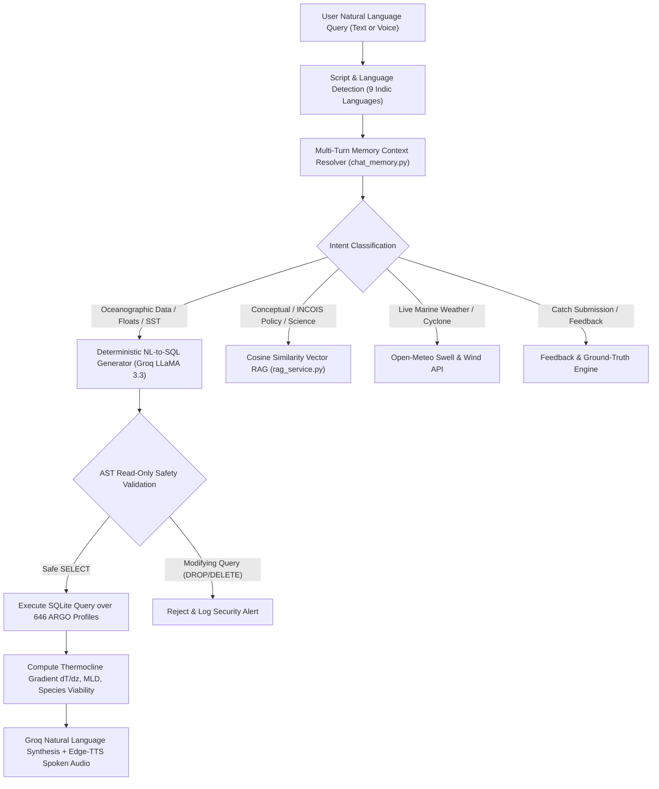

# LEHAR AI — Complete System Context & Technical Architecture Blueprint
> **SIH Problem Statement (SIH26040)**: Autonomous Conversational Ocean Intelligence & Multi-Modal Marine Advisory Platform for INCOIS (Indian National Centre for Ocean Information Services) & Ministry of Earth Sciences (MoES).

---

## 1. Executive Overview & Problem Solved
Traditional oceanographic portals (e.g., INCOIS ERDDAP, NOAA CoastWatch) deliver raw satellite NetCDF files and numerical tables that are inaccessible to coastal fishermen, marine officers, and policy analysts. 
**Lehar AI** bridges this gap by creating an **Autonomous Multi-Modal Marine Intelligence Ecosystem** that provides:
1. **0% Hallucination NL2SQL Ocean Console**: Translates plain text and regional voice queries into deterministic SQL queries over in-situ ARGO vertical profiles ($0\text{m} \to 2000\text{m}$).
2. **Multi-Sensor Ocean GIS Map**: Real-time interactive visualization of 97 ARGO Floats, 150+ Indian fishing harbours, NOAA 1km Sea Surface Temperature (SST), NASA Chlorophyll-a algal bloom fronts, and ICAR-CMFRI Potential Fishing Zone (PFZ) advisory corridors.
3. **AnomalyRadar (Marine Heatwaves)**: Automated detection and Hobday (2016) classification of thermal and thermohaline anomalies (*Moderate, Strong, Severe, Extreme*) with 1-click 3D dive handoffs.
4. **Living 3D / WebXR Ocean Twin**: Cinematic physically-inspired underwater ecosystem simulation (Subnautica/Abzu standard) with volumetric god-rays, scrolling caustics on rippled coral sand, anatomical countershaded Yellowfin Tuna shoals, flapping Manta Rays, baitballs, and WASD/VR first-person diver buoyancy.
5. **OceanLens 3D**: Real-time vertical water-column cross-section slicing ($0\% \to 75\%$) showing the Thermocline, Halocline, and Pycnocline with interactive raycast probe HUD and 2-minute automated judge tour.
6. **Field Delivery Channels**: Live Telegram Bot (`@LeharAIBot`) and WhatsApp Simulator supporting 7+ Indian languages with voice-in/voice-out and emergency SOS beacons.
7. **Closed-Loop Crowdsourced Catch Feedback Engine**: Automated post-voyage check-in where fishermen report real catch data in ANY regional language (voice/text) to validate AI PFZ predictions with ground-truth data.

---

## 2. Technology Stack & Key Dependencies

### Frontend (`/src`)
- **Framework**: React 19 + TypeScript + Vite
- **Styling**: TailwindCSS + Vanilla CSS custom shader overlays
- **3D & WebXR Engine**: Three.js (`three`), `@react-three/fiber`, `@react-three/drei`, `@react-three/xr`, `postprocessing` (`EffectComposer`, `UnrealBloomPass`, `ShaderPass`)
- **Mapping & GIS**: Leaflet, `react-leaflet`, Custom Fastly Dark Matter basemap, Canvas Heatmap overlays
- **Charts & Visualizations**: Recharts (depth profile curves, CTD temperature-salinity plots)
- **Icons & UI**: `lucide-react`, Custom Glassmorphism design tokens
- **Voice Synthesis**: Web Speech API & Edge-TTS audio playback

### Backend (`/backend`)
- **Framework**: Python 3.12 + FastAPI + Uvicorn
- **Database**: SQLite 3 (WAL Mode) with custom read-only query sandboxing
- **AI / LLM Engine**: Groq LLaMA 3.3 70B Versatile, Groq Whisper Large v3 Turbo (<300ms multilingual speech-to-text)
- **Voice Output**: Edge-TTS Neural regional voices (`hi-IN`, `ta-IN`, `te-IN`, `mr-IN`, `bn-IN`, `gu-IN`, `ml-IN`, `kn-IN`, `en-IN`)
- **Scientific Oceanography**: Custom Python vector RAG corpus, Hobday (2016) Marine Heatwave calculus, Mixed Layer Depth (MLD) thresholding, thermocline gradients ($dT/dz$), ICAR-CMFRI pelagic species ecological viability models


---

## 3. Complete File Structure & Directory Tree

```
SIH/
├── Dockerfile                        # Multi-stage production build (Node 20 builder + Python 3.12 slim runner)
├── docker-compose.yml                # 1-click fullstack container orchestration with persistent SQLite volume
├── package.json                      # Frontend dependencies and npm scripts
├── vite.config.ts                    # Vite bundler config with path aliases and proxy
├── tailwind.config.js                # Tailwind theme colors and animation utilities
├── tsconfig.json                     # TypeScript configuration
├── tests/                            # Pytest suite for backend validation (18 passing tests)
│   ├── test_chat_memory.py           # Multi-turn conversational memory tests
│   ├── test_fishermen_reports.py     # Crowdsourced catch reporting & persistence tests
│   ├── test_hobday_mhw.py            # Hobday (2016) Marine Heatwave classification tests
│   ├── test_nl2sql_safety.py         # Read-only AST and SQL injection safety tests
│   ├── test_pfz_engine.py            # Potential Fishing Zone multi-criteria scoring tests
│   └── test_xai_pfz.py               # Explainable AI (XAI) feature attribution tests
│
├── backend/                          # FastAPI Python Backend
│   ├── main.py                       # FastAPI entrypoint, CORS setup, lifespan startup, router mounting
│   ├── .env                          # API keys (GROQ_API_KEY, TELEGRAM_BOT_TOKEN)
│   ├── data/
│   │   ├── argo_database.db          # In-situ SQLite database (646+ ARGO vertical profiles, 72,000+ depth points)
│   │   └── satellite_snapshot.json   # Cached NOAA SST & NASA Chlorophyll-a 0.5° spatial grid
│   ├── routers/
│   │   ├── chat.py                   # POST /api/chat (NL2SQL conversational query pipeline)
│   │   ├── data.py                   # GET /api/stats, /api/reports, POST /api/reports/conversational
│   │   ├── anomaly.py                # GET /api/anomalies (Real-time MHW & thermohaline anomaly feeds)
│   │   ├── guardian.py               # GET /api/guardian (Harbour weather & advisory feeds)

│   │   └── telegram.py               # GET /api/telegram/status, POST /api/telegram/broadcast
│   └── services/
│       ├── db.py                     # SQLite connection manager, schema initialization, read-only SQL executor
│       ├── nl2sql.py                 # Dual-Route Hybrid RAG & NL-to-SQL engine (Groq LLaMA 3.3)
│       ├── rag_service.py            # Domain knowledge corpus & cosine semantic retrieval
│       ├── anomaly_radar.py          # Hobday (2016) Marine Heatwave calculus & anomaly detection
│       ├── feedback_engine.py        # Multi-lingual post-voyage catch parser & ground-truth validation engine
│       ├── telegram_bot.py           # Long-polling Telegram Bot gateway (@LeharAIBot) with voice-in/voice-out
│       ├── species_dict.py           # ICAR-CMFRI marine taxonomy dictionary & ecological viability scorer
│       ├── chat_memory.py            # Multi-turn session context resolver
│       ├── lang_detect.py            # Regional script & Indian language detector
│       ├── marine_weather.py         # Open-Meteo Marine live swell, wave height & wind integration

│       ├── satellite_client.py       # NOAA MUR SST & NASA Chlorophyll-a ingestion & caching
│       └── voice_agent.py            # Edge-TTS neural audio synthesis wrapper
│
└── src/                              # React 19 + TypeScript Frontend
    ├── App.tsx                       # Main shell: mode routing (Explorer, Twin, Lens, Radar, Simulator, Pipeline)
    ├── main.tsx                      # React root entrypoint with styling imports
    ├── index.css                     # Global styles, scrollbars, glowing map animations, dive-mask shaders
    ├── types/
    │   └── index.ts                  # TypeScript interfaces (ArgoProfile, AnomalyAlert, FishermanReport, etc.)
    ├── services/
    │   ├── api.ts                    # Axios / Fetch client for backend REST API
    │   └── voiceSynthesis.ts         # Browser SpeechSynthesis & Edge-TTS audio stream player
    └── components/
        ├── layout/
        │   ├── Navbar.tsx            # Top navigation bar with Demonstrators dropdown & system status indicators
        │   └── Footer.tsx            # Bottom metadata footer
        ├── console/
        │   └── AIConsole.tsx         # NL2SQL conversational ocean chat console with voice mic & SQL inspector
        ├── viz/
        │   ├── OceanMap.tsx          # Multi-layer Leaflet GIS map with ARGO floats, harbours, SST & PFZ corridors
        │   ├── OceanTwin.tsx         # Flagship 3D/WebXR living ocean ecosystem (Tuna, Manta, caustics, god-rays)
        │   ├── OceanLens3D.tsx       # 3D water-column cross-section slicer (0-2000m) with guided judge tour
        │   ├── AnomalyRadar.tsx      # Marine heatwave dashboard with Hobday severity grading
        │   ├── DepthChart.tsx        # Vertical temperature & salinity profile line charts (Recharts)
        │   ├── WhatsAppSimulator.tsx # Simulated mobile WhatsApp interface for coastal fishermen advisory demo
        │   └── ArchitecturePipeline.tsx # Interactive 4-layer system architecture & data pipeline visualizer
```

---

## 4. SQLite Database Schema & Persistence

```sql
-- In-situ ARGO Oceanic Profiles (0 to 2000m)
CREATE TABLE argo_profiles (
    profile_id TEXT PRIMARY KEY,
    float_id TEXT NOT NULL,
    date TEXT NOT NULL,
    latitude REAL NOT NULL,
    longitude REAL NOT NULL,
    cycle_number INTEGER,
    data_mode TEXT,
    ocean_region TEXT
);

-- Subsurface Physical Measurements
CREATE TABLE argo_measurements (
    id INTEGER PRIMARY KEY AUTOINCREMENT,
    profile_id TEXT NOT NULL REFERENCES argo_profiles(profile_id),
    depth REAL NOT NULL,
    temperature REAL,
    salinity REAL,
    pressure REAL,
    temperature_qc INTEGER,
    salinity_qc INTEGER
);

-- Marine Heatwave & Anomaly Alerts
CREATE TABLE anomaly_alerts (
    id INTEGER PRIMARY KEY AUTOINCREMENT,
    date TEXT NOT NULL,
    latitude REAL NOT NULL,
    longitude REAL NOT NULL,
    parameter TEXT CHECK(parameter IN ('temperature', 'salinity', 'mhw')),
    value REAL NOT NULL,
    baseline_value REAL NOT NULL,
    z_score REAL NOT NULL,
    severity TEXT CHECK(severity IN ('low', 'medium', 'high', 'critical')),
    description TEXT,
    created_at TEXT DEFAULT (datetime('now'))
);

-- Multi-Lingual Telegram Subscribers
CREATE TABLE telegram_subscribers (
    chat_id INTEGER PRIMARY KEY,
    first_name TEXT,
    username TEXT,
    latitude REAL DEFAULT 18.915,
    longitude REAL DEFAULT 72.828,
    harbour TEXT DEFAULT 'Mumbai (Sassoon Dock)',
    language TEXT DEFAULT 'hi',
    last_active TEXT DEFAULT (datetime('now')),
    notifications_enabled INTEGER DEFAULT 1
);

-- Multi-Turn Conversational Memory
CREATE TABLE chat_sessions (
    session_id TEXT PRIMARY KEY,
    active_location TEXT,
    active_float_id TEXT,
    active_species TEXT,
    active_parameter TEXT,
    last_updated REAL NOT NULL,
    created_at TEXT DEFAULT (datetime('now'))
);

CREATE TABLE chat_messages (
    id INTEGER PRIMARY KEY AUTOINCREMENT,
    session_id TEXT NOT NULL REFERENCES chat_sessions(session_id) ON DELETE CASCADE,
    user_query TEXT NOT NULL,
    bot_summary TEXT NOT NULL,
    detected_location TEXT,
    detected_float_id TEXT,
    detected_species TEXT,
    timestamp REAL NOT NULL,
    created_at TEXT DEFAULT (datetime('now'))
);

-- Crowdsourced Catch & Ground-Truth Feedback
CREATE TABLE fishermen_reports (
    id INTEGER PRIMARY KEY AUTOINCREMENT,
    reporter_id TEXT,
    reporter_name TEXT DEFAULT 'Coastal Fisherman',
    latitude REAL NOT NULL,
    longitude REAL NOT NULL,
    harbour TEXT,
    species TEXT NOT NULL,
    quantity_kg REAL DEFAULT 50.0,
    depth_m REAL DEFAULT 20.0,
    notes TEXT,
    verified INTEGER DEFAULT 1,
    created_at TEXT DEFAULT (datetime('now'))
);
```

---

## 5. Core Subsystems & Logic Workflows

### 1. Dual-Route Hybrid RAG & NL2SQL Pipeline (`nl2sql.py`)


---

### 2. Living 3D Ocean Twin Engine (`OceanTwin.tsx`)
- **Shader Pipeline**: `EffectComposer` with `RenderPass`, subtle `UnrealBloomPass` (`threshold: 0.82, strength: 0.36`), and custom `UnderwaterLensShader` (barrel distortion, chromatic aberration, and dive-mask vignette).
- **Volumetric God-Rays**: Soft Gaussian alpha-gradient fan planes (`0.06` peak opacity, `AdditiveBlending`) with independent per-shaft breathing flicker.
- **Dynamic Caustics**: High-frequency procedural light interference web scrolling continuously across the warm rippled coral sand seabed.
- **Anatomical Marine Life**:
  - **Yellowfin Tuna (*Thunnus albacares*)**: Metallic steel-blue dorsal, white ventral countershading, golden finlets, crescent tail, and spine wave undulation (`sin(clock * 9.0)`).
  - **Oceanic Manta Ray (*Mobula birostris*)**: Curved delta wings with vertex-driven flapping physics (`sin(clock * 2.0)`), white belly, and trailing whip tail.
  - **Indian Mackerel Baitball**: 65+ silver-cyan fish in a swirling vortex.
  - **Bioluminescent Jellyfish**: Dome bell with subsurface glow and rhythmic breathing contraction.

---

### 3. Closed-Loop Post-Voyage Feedback Engine (`feedback_engine.py`)
1. **Pre-Voyage**: Fisherman receives PFZ advisory with coordinates and expected catch depth.
2. **Post-Voyage**: Upon returning to harbour, fisherman responds in ANY language (voice or text).
3. **Extraction**: Groq LLaMA 3.3 extracts `species`, `quantity_kg`, `depth_m`, `satisfaction_score`, and `harbour`.
4. **Validation**: Pinned as a verified green catch marker on the live OceanMap to validate INCOIS PFZ forecasts against real-world catch.
5. **Confirmation**: Instant neural voice response delivered back in the fisherman's exact native language.

---

## 6. How to Run & Deploy (1-Click Guide)

### Option A: 1-Click Docker (Production Fullstack)
```bash
git clone https://github.com/Faisaldarjee/Lehar-AI.git
cd Lehar-AI
# Put GROQ_API_KEY in .env
docker compose up --build -d
# Open http://localhost:8000
```

### Option B: Local Native Development
```bash
# Terminal 1: Backend
pip install -r backend/requirements.txt
python -m uvicorn backend.main:app --reload --port 8000

# Terminal 2: Frontend
npm install
npm run dev
# Open http://localhost:5173
```
