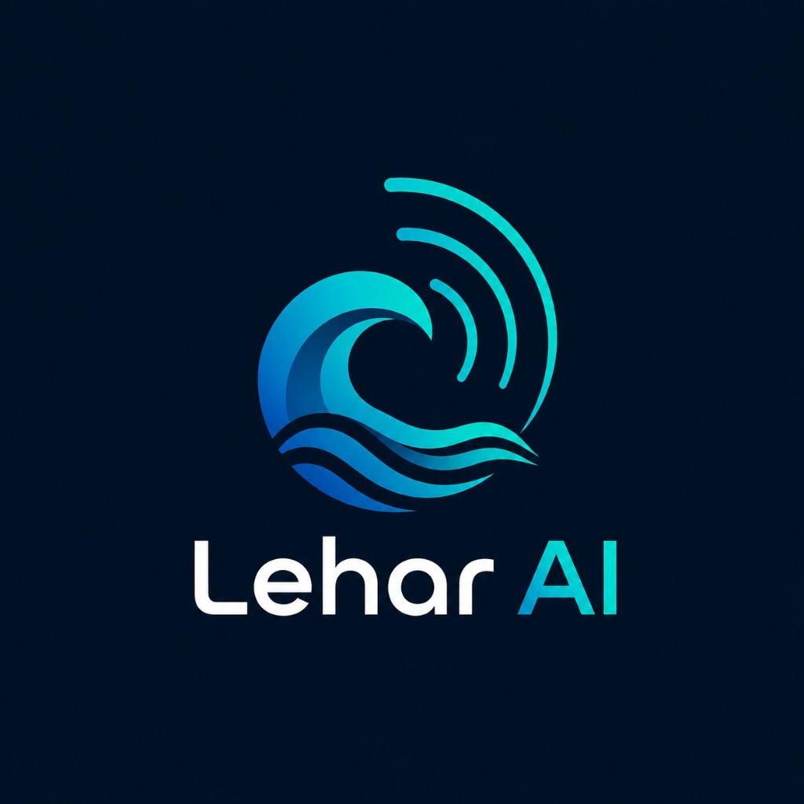

<div align="center">

# 🌊 Lehar AI — Know the Sea. Know the Way.
### AI-Powered Conversational Intelligence & Multimodal Discovery for Global ARGO Ocean Data
**Smart India Hackathon 2026 • Problem Statement SIH26040 • Ministry of Earth Sciences (MoES / INCOIS)**

<p align="center">
  
</p>

[](https://fastapi.tiangolo.com)
[](https://react.dev)
[](https://groq.com)
[](https://threejs.org)
[](https://leafletjs.com)

</div>

---

## 📖 Overview

**Lehar AI** is an enterprise-grade AI ocean intelligence platform built for **INCOIS (Indian National Centre for Ocean Information Services)** and the **Ministry of Earth Sciences (MoES)**. It democratizes access to complex multi-dimensional **ARGO NetCDF hydrographic ocean float observations** (temperature, salinity, pressure, mixed layer depth) through natural language conversation, multilingual voice synthesis, interactive 3D WebGL bathymetric cross-sections, and WhatsApp/Telegram last-mile coastal delivery.

---

## 🚀 Key Innovations & Differentiators

1. **Natural Language to Safe Read-Only SQL (NL2SQL)**: Converts natural queries in English or regional maritime dialects into spatial bounding-box SQLite queries in `<500ms` with zero write risks.
2. **Deterministic Response Shaping**: Eliminates LLM hallucination of numerical metrics by calculating hero stats, location chips, and depth ranges deterministically in Python.
3. **OceanVoice (Multilingual Vernacular Speech)**: Browser-native Web Speech API speech-to-text recognition and text-to-speech synthesis supporting Hindi (`hi-IN`), Tamil (`ta-IN`), Telugu (`te-IN`), and Indian English (`en-IN`).
4. **Potential Fishing Zone (PFZ) Advisory Engine**: Calculates high-probability pelagic fish aggregation zones using INCOIS-standard thermal front detection, mixed layer depth (MLD), and nearest coastal harbour bearings.
5. **AnomalyRadar Watchdog**: Proactive marine heatwave (MHW) detection based on Hobday et al. (2016) classification (Categories I–IV) and robust climatological Z-score baselines.
6. **OceanLens 3D**: Three.js WebGL water column bathymetric cross-sections from 0 to 2,000 meters depth.
7. **WhatsApp Coastal Simulator**: Live simulated WhatsApp/Telegram bot for 1 Crore+ artisanal Indian fishermen without requiring app downloads.
8. **Lehar Classroom (Adopt a Float)**: Experiential ocean science education module aligned with **National Education Policy (NEP 2020)**.

---

## 🏗️ 4-Layer System Architecture

```
┌─────────────────────────────────────────────────────────────┐
│                    LAYER 1: DATA INGESTION                  │
│  ARGO GDAC / INCOIS NetCDF → xarray / argopy → SQLite DB    │
│  (646 Profiles • 97 Active Floats • 351,004 Measurements)   │
└──────────────────────────┬──────────────────────────────────┘
                           │
┌──────────────────────────▼──────────────────────────────────┐
│              LAYER 2: USER INTERFACE & ACCESS               │
│  React 19 + TypeScript + Space Grotesk UI + WhatsApp Bot    │
│  OceanVoice Speech Synthesis (Hindi, Tamil, Telugu, English)│
└──────────────────────────┬──────────────────────────────────┘
                           │
┌──────────────────────────▼──────────────────────────────────┐
│                   LAYER 3: AI INTELLIGENCE                  │
│  Groq LLaMA 3.3 70B NL2SQL + Spatial Bounding Boxes         │
│  AnomalyRadar Watchdog (Z-score & Hobday 2016 MHW Baseline) │
│  PFZ Advisory Engine (SST + MLD + Coastal Harbour Bearings) │
└──────────────────────────┬──────────────────────────────────┘
                           │
┌──────────────────────────▼──────────────────────────────────┐
│                  LAYER 4: RESPONSE COMPOSER                 │
│  3D OceanLens WebGL + Recharts CTD Depth + Leaflet Markers  │
│  Hero Metric Card + 3-Column Chips + CSV Data Export        │
└─────────────────────────────────────────────────────────────┘
```

---

## 🛠️ Tech Stack

* **Frontend:** React 19, TypeScript, Vite, Tailwind CSS 4, Recharts, Three.js, Leaflet, Lucide Icons.
* **Backend:** FastAPI, Python 3.12, Uvicorn, SQLite, Pydantic v2, Groq SDK.
* **AI & LLM:** Groq LLaMA 3.3 70B Versatile.
* **Audio & Speech:** Web Speech API (`SpeechRecognition` & `SpeechSynthesis`).

---

## ⚡ Quickstart & Setup Guide

### 1. Clone the Repository
```bash
git clone https://github.com/Faisaldarjee/Lehar-AI.git
cd Lehar-AI
```

### 2. Backend Setup
```bash
cd backend
python -m venv venv
venv\Scripts\activate       # On Linux/macOS: source venv/bin/activate
pip install -r requirements.txt
cp .env.example .env        # Add your GROQ_API_KEY in .env
python -m uvicorn backend.main:app --host 127.0.0.1 --port 8000 --reload
```

### 3. Frontend Setup
```bash
npm install
npm run dev
```

Visit **`http://localhost:5173`** to access the live dashboard.

---

## 👥 Team: Ctrl Alt Elites
* **Problem Statement:** SIH26040 — AI-Powered Conversational Interface for ARGO Ocean Data Discovery and Visualization
* **Institution/Organization:** INCOIS • Ministry of Earth Sciences (MoES), Govt. of India

---
<div align="center">
  <sub>Built with ❤️ for Indian Ocean Science & Coastal Communities</sub>
</div>
